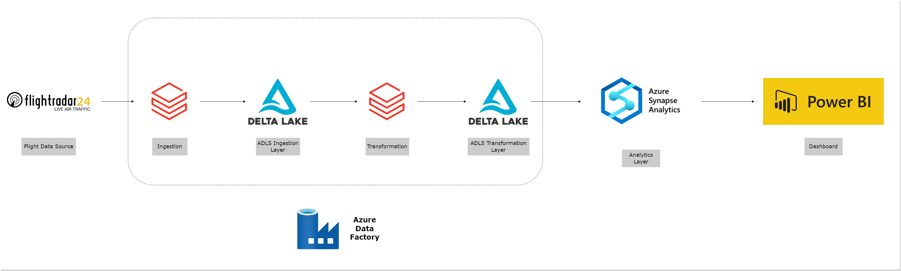
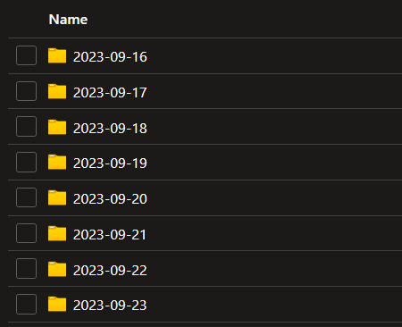
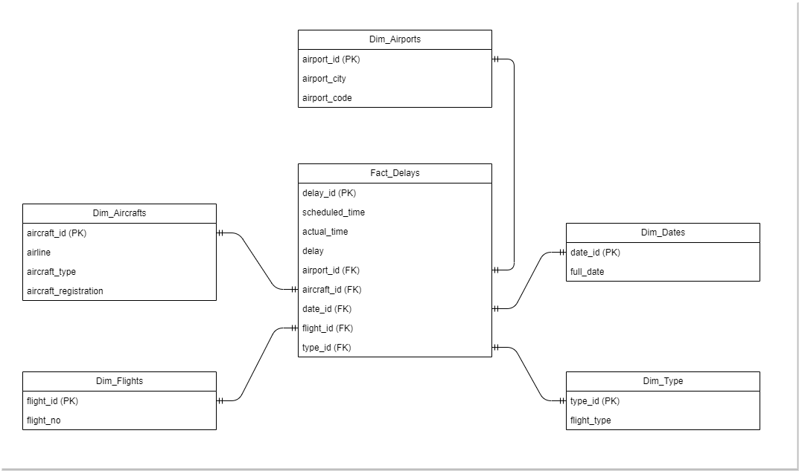
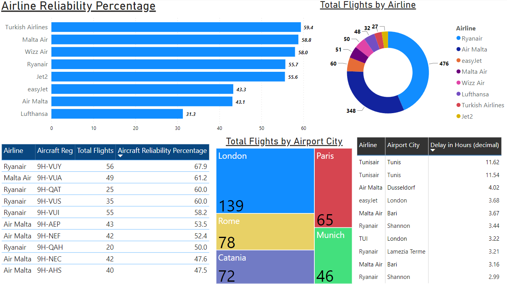

# **Azure End-to-End Pipeline - Airline Reliability**

## **Architecture** 

  

## **Motivation** 

The aim of this project was to get familiar with popular Azure data engineering services, mainly; Azure Data Factory (ADF), Azure Databricks, Azure Data Lake Storage (ADLS) Gen2 & Azure Synapse.
A Power BI Dashboard was also created to visualize the results.

## **Data**

For this project, arrivals and departures to/from Malta International Airport (MLA) were analyzed and data for 1 week was gathered from the 16th till the 23rd of September 2023. 

## **Summary**

This project uses ADF as an orchestration tool. Every day for the whole week an ADF trigger at 11:30am (CEST timezone) would be initiated so that by mid-day the data would be readily available. The steps that make up the project are as follows:

1. *Flight Data Source*: The data was obtained from the [FlightRadar24 website](https://www.flightradar24.com/data/airports/mla) using a python script in [Azure Databricks](https://azure.microsoft.com/en-us/products/databricks). Web scraping best practices are used, such as; setting random sleep times and rotating user-agents.
2. *Ingestion*: Using Azure Databricks, the data is read using PySpark, ingested and saved as [Delta Lake](https://delta.io/) format in an (Ingestion) [ADLS](https://azure.microsoft.com/en-us/products/storage/data-lake-storage) container.
3. *Transformation*: Again Azure Databricks is used to transform the data using PySpark. The data is again saved in Delta lake format in another (Transformation) ADLS container. 

*Note*: In both ingestion & transformation ADLS containers, data is [partitioned](https://learn.microsoft.com/en-us/azure/architecture/best-practices/data-partitioning) by date

  

4. *Analytics*: A [Star Schema](https://www.databricks.com/glossary/star-schema) dimensional model is created in [Azure Synapse](https://azure.microsoft.com/en-us/products/synapse-analytics). Views are created on top of this model to analyze the data and facilitate reporting. The built-in Synapse serverless SQL database is used for all scripts.

  

5. *Dashboarding*: [Power BI](https://powerbi.microsoft.com/en-us/) is connected with the SQL database in Azure Synapse. To get the latest data, the _Refresh_ button is pressed in Power BI (this would be done after the ADF trigger is completed).

## **Tools & Technologies**

* *Orchestration* - **ADF**
* *Data Storage* - **ADLS Gen2**
* *Transformation* - **Azure Databricks**
* *Analytics* - **Azure Synapse**
* *Data Visualization* - **Power BI**
* *Languages* - **PySpark, Python, SQL**

## **Dashboard**

  

